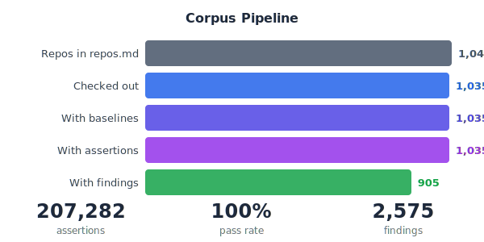
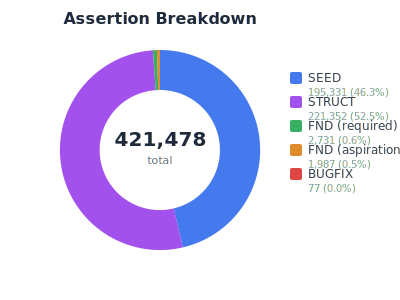
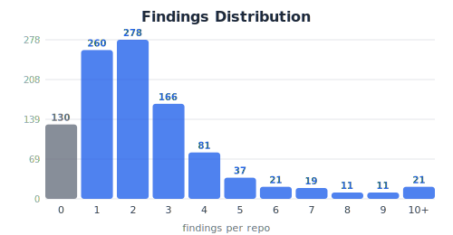
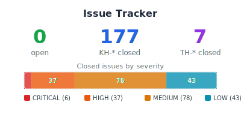
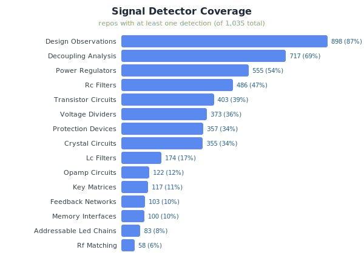
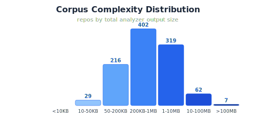
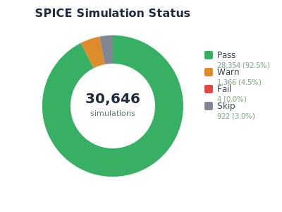
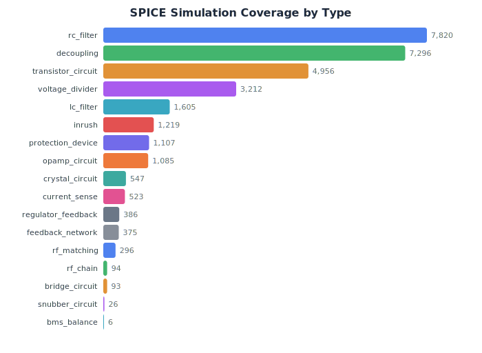
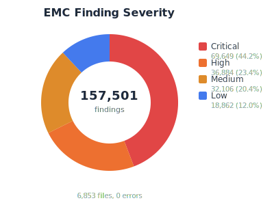
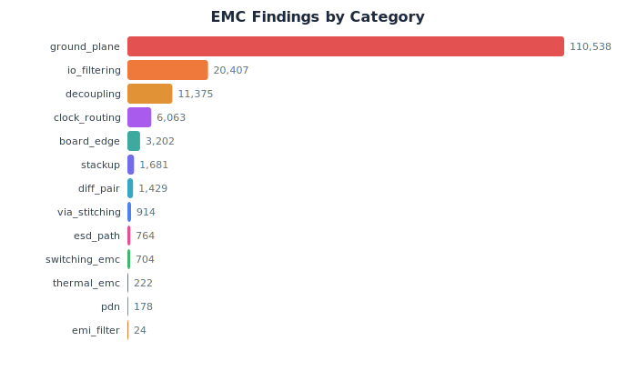

# kicad-happy Test Harness

Test harness for validating [kicad-happy](https://github.com/aklofas/kicad-happy) analyzers against a corpus of 5,822 real-world open-source KiCad projects (organized as `owner/repo` subdirectories). Provides a 3-layer regression testing system with 2.1M+ machine-checkable assertions, 424 unit tests across 23 test files, 42 auto-discovered signal detectors, 145,000+ SPICE simulations across 17 subcircuit types, and 192,000+ EMC pre-compliance findings across 15 rule categories with SPICE-enhanced PDN analysis.

**The system primarily tests consistency, not correctness.** A 100% assertion pass rate means outputs haven't drifted since they were last seeded — it does not mean the analyzers are right. See [philosophy.md](philosophy.md) for the distinction and [methodology.md](methodology.md) § "Weaknesses and limitations" for the full accounting of what this harness cannot verify.

v1.2 released 2026-04-10. v1.3 is in progress and begins adding correctness-testing infrastructure (parser verification, synthetic detector fixtures, a small curated gold-standard tier, metamorphic tests, property invariants) for a narrow subset of the corpus — see [methodology.md](methodology.md) § "Toward correctness" for the scope and explicit limitations.

For a deep dive into the architecture, reasoning, and design decisions, see [methodology.md](methodology.md).

**For operational procedures, see [RUNBOOK.md](RUNBOOK.md)** — 20 checklists covering
code change validation, feature testing, corpus health, issue management, constants
verification, Layer 3 reviews, release preparation, domain detector testing, and more. Agents should follow
the relevant checklist rather than improvising workflows.

## Analytics

Auto-generated by `python3 tools/generate_analytics.py`. Charts update from live corpus data.

| | |
|---|---|
|  |  |
|  |  |
|  |  |
|  |  |
|  |  |

## Quick start

```bash
# 1. Clone the kicad-happy repo alongside this one (or set KICAD_HAPPY_DIR)
git clone <kicad-happy-url> ../kicad-happy

# 2. Clone test repos
python3 checkout.py

# 3. Discover KiCad files
python3 discover.py

# 4. Run analyzers (use --jobs for parallelism, --repo to target one repo)
python3 run/run_schematic.py --jobs 4
python3 run/run_pcb.py --jobs 4
python3 run/run_gerbers.py --jobs 4

# 4b. Run SPICE simulations (requires ngspice, reads schematic outputs)
python3 run/run_spice.py --jobs 16

# 4c. Run EMC analysis (reads schematic + PCB outputs)
python3 run/run_emc.py --jobs 16

# 5. Snapshot and compare baselines
python3 regression/snapshot.py --repo {repo}
python3 regression/compare.py --repo {repo}

# 6. Run assertions
python3 regression/run_checks.py --repo {repo}

# 7. Validate outputs
python3 validate/validate_outputs.py --repo {repo}

# 8. Promote improvements
python3 regression/promote.py --repo {repo} --apply

# Or use the unified orchestrator (runs unit tests + assertions + validators)
python3 harness.py validate                        # full validation
python3 harness.py validate --cross-section smoke  # smoke pack subset
python3 harness.py run --smoke                     # generate + validate smoke pack
```

### Requirements

- **Python 3.8+** (stdlib only -- no external dependencies for core scripts)
- **Git** (for cloning test repos)
- **ngspice** (optional, for SPICE simulations -- `apt install ngspice` / `brew install ngspice` / [ngspice.sourceforge.io](https://ngspice.sourceforge.io) for Windows, or set `NGSPICE_PATH` env var)

### Finding kicad-happy

All scripts resolve the kicad-happy analyzer location in this order:

1. `KICAD_HAPPY_DIR` environment variable
2. `../kicad-happy` (sibling directory)

```bash
export KICAD_HAPPY_DIR=/path/to/kicad-happy   # if not at ../kicad-happy
```

## Analyzers under test

| Analyzer | Input | Description |
|----------|-------|-------------|
| `analyze_schematic.py` | `.kicad_sch`, `.sch` | Components, nets, signal paths, BOM, design analysis |
| `analyze_pcb.py` | `.kicad_pcb` | Footprints, tracks, vias, zones, DFM analysis |
| `analyze_gerbers.py` | Gerber directories | Layer completeness, drill alignment |
| `simulate_subcircuits.py` | Schematic JSON | SPICE simulation of 17 subcircuit types + Monte Carlo tolerance analysis (requires ngspice) |
| `analyze_emc.py` | Schematic + PCB JSON | EMC pre-compliance risk analysis (15 rule categories, 40 rules, 6 standards) |
| `analyze_thermal.py` | Schematic + PCB JSON | Thermal hotspot estimation — junction temp, proximity warnings |
| `diff_analysis.py` | Two analyzer JSONs | Diff-aware design reviews (components, signals, findings, SPICE status) |
| `what_if.py` | Schematic JSON + changes | Interactive parameter sweep with optional SPICE re-simulation |

All analyzers are pure Python 3.8+ stdlib. They produce JSON output and support KiCad versions 5 through 9.

For details on the SPICE simulation system, see [spice.md](spice.md).
For details on the EMC pre-compliance system, see [emc.md](emc.md).

**Note on `.sch` files**: `discover.py` filters legacy `.sch` files by checking the header for "EESchema" (KiCad 5 signature) to exclude Eagle XML/binary `.sch` files.

## Regression testing (3-layer approach)

All operations are per-repo. Data is organized by `reference/{owner}/{repo}/{project}/` where project is the subpath to the KiCad project directory with `/` encoded as `_`. Repos use `owner/repo` format throughout (e.g., `greatscottgadgets/hackrf`).

### Layer 1: Baselines

Compact snapshots of analyzer outputs, checked into git. Any machine can diff against them.

```bash
python3 regression/snapshot.py --repo {repo}
python3 regression/compare.py --repo {repo}
python3 regression/compare.py --all --only-changes
```

### Layer 2: Assertions

Machine-checkable facts about what an analyzer should find in a specific file. Stored in `reference/{repo}/{project}/assertions/`. Four categories of assertions work together:

| Prefix | Source | Description |
|--------|--------|-------------|
| `SEED-*` | `seed.py` | Coarse count-based assertions (component counts, section sizes). Tolerance scales with count: <50→10%, 50-200→5%, >200→3% |
| `STRUCT-*` | `seed_structural.py` | Per-detection structural assertions (specific component refs in specific detectors) |
| `FND-*` | `findings.py promote` | Promoted from Layer 3 LLM findings, including aspirational assertions for known bugs |
| `BUGFIX-*` | `generate_bugfix_assertions.py` | Prevent fixed bugs from returning, tied to specific KH-* issues |
| `NEG-*` | `seed_negative.py` | Negative assertions from false-positive findings (prevent regressions of FP fixes) |

Supported operators: `range`, `min_count`, `max_count`, `equals`, `exists`, `not_exists`, `greater_than`, `less_than`, `field_equals`, `contains_match`, `not_contains_match`, `count_matches`.

```bash
python3 regression/run_checks.py --repo {repo}       # run all assertions

# Generate assertions
python3 regression/seed.py --repo {repo}              # coarse SEED-* assertions
python3 regression/seed_structural.py --repo {repo}   # per-ref STRUCT-* assertions
python3 regression/generate_bugfix_assertions.py --apply  # BUGFIX-* from registry
```

**Aspirational assertions**: Assertions from findings marked `"aspirational": true` are expected to fail until the underlying bug is fixed. They are excluded from the pass rate but tracked for drift.

### Layer 3: LLM review

Review packets pair source files with analyzer output summaries for independent quality verification by Claude. Findings capture what the analyzer got right, wrong, or missed.

Each finding item can have a machine-checkable `check` field (auto-generated by `generate_finding_checks.py` using `refextract.py`). These checks enable precise drift detection and automatic promotion to assertions.

```bash
# Generate review packets
python3 regression/packet.py --strategy random --count 5
python3 regression/packet.py --strategy changed --repo {repo}

# Manage findings
python3 regression/findings.py list
python3 regression/findings.py stats
python3 regression/findings.py render
python3 regression/findings.py promote FND-00000001

# Auto-generate check fields for finding items
python3 regression/generate_finding_checks.py --apply
python3 regression/generate_finding_checks.py --repo {repo} --dry-run
```

### How the layers connect

```
                  generate_finding_checks.py
                         |
LLM review --> findings (with check fields)
                  |                    |
          promote (FND-*)         drift.py
                  |                    |
              assertions <-------- regression/improvement detected
                  |
              run_checks.py
                  |
            100% pass rate
                  |
    bugfix_registry.json --> generate_bugfix_assertions.py (BUGFIX-*)
```

- **Baselines** catch broad structural changes (new/removed sections, count shifts)
- **Assertions** catch specific regressions (a known-good detection disappearing)
- **Findings** capture context that can't be automated (why something is wrong, what's missing)
- **Bugfix registry** prevents fixed bugs from returning with targeted assertions per KH-* issue

`drift.py` closes the loop by re-checking findings against current outputs, using the `check` fields for precise comparison rather than just section-level counts. It surfaces regressions, improvements, and possibly-fixed bugs.

```bash
python3 regression/drift.py --repo {repo}
python3 regression/cleanup_drift.py                   # remove stale drift items
```

### Bugfix registry

`bugfix_registry.json` maps KH-* issue numbers to specific assertions that verify the fix. Each entry records the issue, fix type, repo, file, and a check that would fail if the bug returned.

```bash
python3 regression/generate_bugfix_assertions.py              # dry run
python3 regression/generate_bugfix_assertions.py --apply      # write assertion files
python3 regression/generate_bugfix_assertions.py --issue KH-150  # one issue
```

### Promoting improvements

```bash
python3 regression/promote.py --repo {repo}          # dry run
python3 regression/promote.py --repo {repo} --apply   # promote
```

## Constants audit

The analyzer scripts contain 335 hardcoded constants: lookup tables, keyword lists, numeric thresholds, and regex patterns. `audit_constants.py` scans analyzer source using Python AST, builds a registry of all constants, and tracks verification status.

```bash
python3 validate/audit_constants.py scan                # scan scripts, update registry
python3 validate/audit_constants.py scan --diff          # show what changed since last scan

python3 validate/audit_constants.py list                 # all constants
python3 validate/audit_constants.py list --unverified    # unverified only
python3 validate/audit_constants.py list --risk critical  # critical risk constants
python3 validate/audit_constants.py list --risk high      # high+ risk constants
python3 validate/audit_constants.py list --category datasheet_lookup
python3 validate/audit_constants.py show CONST-001       # detail view

python3 validate/audit_constants.py verify CONST-001 --source "LM317 datasheet SNVS774Q"
python3 validate/audit_constants.py verify CONST-001 --entry TPS5430 --source "datasheet SLVS632L"

python3 validate/audit_constants.py corpus              # cross-reference against outputs
python3 validate/audit_constants.py stats                # summary breakdown
python3 validate/audit_constants.py report               # full text report
python3 validate/audit_constants.py render               # generate constants_registry.md
```

### Two-dimensional risk scoring

Each constant is scored on two independent axes:

- **Impact** (0.0-1.0) -- How bad is it if this constant is wrong. A hallucinated Vref value silently produces incorrect voltage calculations; a wrong keyword list causes misclassification.
- **Overfit** (0.0-1.0) -- Whether this constant pulls its weight across the corpus, or was added to fix one project and doesn't generalize. Starts with structural heuristics (inline definitions, small local lists), then `corpus` fills in real data from analyzer outputs.

These combine into a **risk score**: `max(impact * (1 - verified_fraction), overfit)`. Verification drives risk down -- a fully-verified high-impact constant drops to low risk. High overfit stays risky regardless.

| Risk level | Score | Example |
|---|---|---|
| critical | >= 0.7 | `_REGULATOR_VREF` (92 unverified Vref values from datasheets) |
| high | >= 0.5 | `type_map` (64-entry component classifier) |
| medium | >= 0.3 | Keyword lists for IC family matching |
| low | < 0.3 | Format codes, unit conversions, verified tables |

### Corpus analysis

`corpus` scans all analyzer outputs to measure which constants actually fire across the test corpus. For each constant, it records how many repos exercise it:

- **`_REGULATOR_VREF`** -- traces `vref_source: "lookup"` in power_regulators to identify which prefix keys match real parts. Per-entry hit counts show which entries are exercised vs dead weight.
- **`type_map`** -- counts which reference designator prefixes appear across all components.
- **Signal detector keywords** -- maps keyword lists to their signal_analysis sections and counts repos with non-empty results.

Entries with zero corpus hits get flagged (`corpus_unused_entries`) and increase the overfit score. This surfaces constants that were potentially added for one project and never exercised again.

### Categories

Each constant is auto-classified into a category that determines what kind of verification it needs:

| Category | Description | Verification source |
|---|---|---|
| `physics` | Unit conversions, coordinate tolerances | Textbook / auto-verified |
| `standard` | KiCad format codes, IPC designators, SI prefixes | KiCad docs, IPC standards |
| `datasheet_lookup` | Part-specific values (Vref, quiescent current) | Manufacturer datasheets |
| `heuristic_threshold` | Empirical cutoffs and scoring tables | Engineering justification + corpus tuning |
| `keyword_classification` | Part families, net name patterns, pin names | KiCad stdlib + domain knowledge |

The registry (`reference/constants_registry.json`) tracks stable IDs, content hashes for drift detection, per-entry verification for lookup tables, corpus hit data, and both risk dimensions.

## Equation tracking

The analyzer scripts use 86 engineering formulas — radiation calculations, impedance estimates, filter frequencies, harmonic analysis, and more. Unlike constants, equations can't be detected by AST alone, so they use structured comment tags (`# EQ-NNN:`) placed at each formula, with a scanner that detects changes via function body hashing.

```bash
python3 validate/audit_equations.py scan                # scan for EQ tags, update registry
python3 validate/audit_equations.py scan --diff          # show what changed since last scan
python3 validate/audit_equations.py list                 # all tracked equations
python3 validate/audit_equations.py list --unverified    # unverified only
python3 validate/audit_equations.py show EQ-001          # detail view
python3 validate/audit_equations.py verify EQ-001 --source "Ott Eq. 6.4 p. 156"
python3 validate/audit_equations.py render               # generate equation_registry.md
python3 validate/audit_equations.py untagged             # find math functions without EQ tags
```

Each equation is tagged in the kicad-happy source with its formula and authoritative source:

```python
# EQ-001: E = K × f² × A × I / r (differential-mode loop radiation)
# Source: Ott "EMC Engineering" (Wiley, 2009) Eq. 6.4
# Source: MSU EMC Lab Module 9 p.9-16 (egr.msu.edu)
k = 2.632e-14 if ground_plane else 1.316e-14
return k * freq_hz**2 * area_m2 * current_a / distance_m
```

The registry (`reference/equation_registry.json`) tracks each equation's ID, formula, file, function, category, impact level, verification status, and source citations. When a function body changes (detected by AST hash), the equation is marked `stale` for re-verification. The `untagged` command uses heuristic detection (presence of `math.sqrt`, `math.pi`, `**2`, etc.) to find functions with engineering math that lack EQ tags.

**Verification quality:** 12 equations verified with online URLs (MSU EMC Lab PDFs, LearnEMC calculators, EDN articles, IEEE papers via Semantic Scholar, TI app notes). 36 are self-evident physics (Ohm's law, Euclidean distance). 16 are derived from other verified equations. The remaining 19 are engineering heuristics clearly labeled as such.

## Validation and reporting

```bash
# Unified orchestrator (recommended)
python3 harness.py validate                             # full pipeline
python3 harness.py validate --cross-section smoke       # smoke pack subset
python3 harness.py run --smoke                          # generate + validate smoke pack

# Individual validators
python3 validate/validate_outputs.py --repo {repo}      # structural invariants (--json)
python3 validate/validate_spice.py --repo {repo}        # SPICE cross-validation (--json)
python3 validate/validate_emc.py --repo {repo}          # EMC cross-validation (--summary)
python3 validate/cross_analyzer.py --summary            # schematic↔PCB↔EMC↔SPICE consistency
python3 validate/validate_schema.py scan                # build field inventory
python3 validate/validate_schema.py diff                # detect schema drift
python3 validate/validate_schema.py auto-seed           # generate assertions for new fields
python3 validate/extract_mpns.py --repo {repo}          # extract MPNs from outputs
python3 validate/analyze_bom_mismatch.py --repo {repo}  # BOM qty vs component count
python3 validate/download_datasheets.py --project {repo} --status   # datasheet downloads
python3 validate/validate_mpns.py --limit 50            # validate MPNs against APIs
python3 validate/verify_constants_online.py --dry-run   # verify constants vs DigiKey API

# Quality assurance
python3 validate/mutation_test.py --repo {repo} --type schematic  # assertion effectiveness
python3 regression/check_staleness.py                   # stale/missing assertions
python3 regression/seed_negative.py --all --dry-run     # false-positive assertion candidates
python3 tools/coverage_detector_map.py                   # per-detector coverage matrix
python3 validate/detector_dashboard.py                  # field-level detector stats
python3 validate/detector_dashboard.py --detector X     # one detector detail

# Change management
python3 tools/detect_changes.py                          # upstream kicad-happy change impact
python3 tools/detect_changes.py --since HEAD~5 --json   # diff against older commit
python3 tools/detect_changes.py generate-map            # auto-generate impact map from imports

# Reporting
python3 tools/coverage_report.py --top 20                # uncovered high-complexity repos
python3 tools/generate_health_report.py                  # single-page health summary
python3 tools/generate_health_report.py --json --log     # append to health_log.jsonl
python3 tools/generate_health_report.py --reset-baseline "reason"  # set new comparison baseline
python3 regression/audit_bugfix_coverage.py             # gaps in bugfix regression
python3 regression/audit_bugfix_paths.py                # verify bugfix assertion paths

# Catalog
python3 tools/generate_catalog.py                        # build repo metadata catalog
python3 tools/generate_catalog.py --query "category=ESP32"    # query by category
python3 tools/generate_catalog.py --query "tags contains rf"  # query by tag

# Testing
python3 run_tests.py --unit                             # unit tests (424 tests)
python3 run_tests.py --tier unit                        # same as --unit
python3 run_tests.py --tier online                      # integration tests (need API keys)
python3 run_tests.py --quick-sanity                     # assertions on smoke pack repos
```

## Repo management

- **repos.md** -- Master list of all repos with URLs, pinned commit hashes, and categories (via `## Section` headers)
- **status.md** -- Operational log of batch testing progress
- **reference/repo_catalog.json** -- Searchable metadata catalog (KiCad versions, complexity, quality scores, design domains, tags)
- **reference/smoke_pack.md** -- Curated ~20 repos for `--smoke` mode, tagged by capability

### Adding test repos

Edit `repos.md` directly under the appropriate `## Category` section:

```
- https://github.com/user/repo @ abc123def456
```

All repos must have a pinned 40-char commit hash. All clones are shallow.

```bash
python3 checkout.py                              # clone new repos
python3 checkout.py --check-updates --jobs 16    # check for upstream updates (parallel)
python3 checkout.py --check-updates --pin        # update hashes in repos.md
python3 tools/generate_catalog.py                 # rebuild metadata catalog
```

## Issue tracking

Issues are discovered opportunistically while running analyzers and reviewing outputs:

- **ISSUES.md** -- Open issues only. Removed when fixed.
- **FIXED.md** -- Closed issues with root cause, fix details, and verification.

Prefixes: `KH-*` for analyzer bugs, `TH-*` for harness issues. Numbers are globally unique and never reused.

## Directory structure

```
spice.md                    # SPICE simulation documentation
emc.md                      # EMC pre-compliance testing documentation
repos.md                    # Master repo list (5,822 repos, categories via ## headers)
status.md                   # Batch testing progress log
ISSUES.md                   # Open issues (KH-* analyzer, TH-* harness)
FIXED.md                    # Closed issues with fix details
checkout.py                 # Clone repos + check upstream updates
discover.py                 # Find KiCad files, write manifests
harness.py                  # Unified entry point (test, validate, run, health, status)
run_tests.py                # Test runner (--unit, --tier unit|online|all, --json)
utils.py                    # Shared utilities (path resolution, unified runner, output validation)
RUNBOOK.md                  # 20 operational checklists for agents

tools/                      # Standalone tools and reports
  add_repos.py              #   Batch-add validated repos to corpus (--batch-size, --resume)
  coverage_detector_map.py  #   Per-detector coverage matrix (auto-discovered from schema)
  coverage_report.py        #   Assertion coverage analysis (--top, --uncovered-only)
  detect_changes.py         #   Upstream change impact (--since, --json, generate-map)
  detect_duplicates.py      #   Find duplicate repos in the corpus
  generate_analytics.py     #   Generate SVG analytics charts from corpus data
  generate_catalog.py       #   Repo metadata catalog (--query, --json)
  generate_cross_sections.py #  Named repo subsets for targeted testing (--list, --show)
  generate_health_report.py #   Health metrics + drop detection (--json, --log, --reset-baseline)
  generate_validation_md.py #   Generate validation summary markdown
  reclassify_repos.py       #   Reclassify repos into categories
  search_repos.py           #   GitHub/GitLab/Codeberg discovery (--all, --source)
  validate_candidates.py    #   Clone + check KiCad files + score quality (--jobs, --min-components)

run/                        # Batch-run analyzers (all support --repo, --jobs)
  run_schematic.py
  run_pcb.py
  run_gerbers.py
  run_spice.py              #   SPICE simulations (--extra-args for MC, requires ngspice)
  run_emc.py                #   EMC pre-compliance analysis (reads schematic + PCB)
  run_datasheets.py         #   Download datasheets + validate extractions
  # All runners support --validate, --json, and write _timing.json

regression/                 # 3-layer regression testing
  _differ.py                #   Semantic JSON diff engine
  checks.py                 #   Assertion data model + evaluation engine (12 operators)
  refextract.py             #   Component ref extraction from descriptions
  snapshot.py               #   Snapshot outputs to reference/ baselines
  compare.py                #   Diff current outputs vs baselines
  run_checks.py             #   Run assertions against outputs
  check_staleness.py        #   Detect stale assertions vs outputs (--repo, --type)
  seed.py                   #   Generate SEED-* assertions (--prune-stale, field specs)
  seed_structural.py        #   Generate per-ref STRUCT-* assertions
  seed_negative.py          #   Generate NEG-* from false-positive findings (--dry-run)
  findings.py               #   Manage LLM review findings + promote to assertions
  generate_finding_checks.py #  Auto-generate check fields for finding items
  drift.py                  #   Detect findings drift against outputs
  cleanup_drift.py          #   Remove stale drift items
  packet.py                 #   Generate review packets for LLM analysis
  review.py                 #   LLM review workflow
  promote.py                #   Promote improved results/ to reference/
  bugfix_registry.json      #   KH-* issue -> regression assertion mapping
  generate_bugfix_assertions.py #  Generate BUGFIX-* assertions from registry
  audit_bugfix_coverage.py  #   Audit gaps between FIXED.md and registry
  audit_bugfix_paths.py     #   Verify bugfix assertion paths resolve to outputs

validate/                   # Output quality + constants audit
  validate_outputs.py       #   Structural invariants on analyzer JSON (--json)
  validate_spice.py         #   Cross-validate SPICE vs analyzer values (--json)
  validate_emc.py           #   Cross-validate EMC vs analyzer values (--summary)
  cross_analyzer.py         #   Cross-analyzer consistency (sch↔PCB↔EMC↔SPICE)
  mutation_test.py          #   Mutation testing for assertion effectiveness
  validate_schema.py        #   Schema drift detection for all 5 output types (scan/diff/auto-seed)
  detector_dashboard.py     #   Field-level detector statistics (--detector, --json)
  verify_constants_online.py #  Verify constants against DigiKey parametric data
  extract_mpns.py           #   Extract MPN + manufacturer pairs
  validate_mpns.py          #   Validate MPNs against distributor APIs
  analyze_bom_mismatch.py   #   BOM qty vs component count analysis
  download_datasheets.py    #   Download datasheets from multiple sources
  audit_constants.py        #   AST-based constant registry + verification (335 constants)
  audit_equations.py        #   EQ-tag equation tracking + verification (86 equations)

tests/                      # Unit tests (424 tests across 23 files, TIER="unit")
  test_analysis_cache.py    #   Analysis cache correctness (26 tests)
  test_batch_review.py      #   Batch review prefix extraction
  test_checks.py            #   Assertion evaluation engine (43 tests)
  test_datasheet_verify.py  #   Datasheet extraction verification (27 tests)
  test_design_intent.py     #   design_intent schema + auto-detection (9 tests)
  test_detect_sub_sheet.py  #   Sub-sheet detection 5-tier strategy (10 tests)
  test_detection_schema.py  #   Stable detection_id field validation
  test_diff_analysis.py     #   Diff-aware design review output
  test_differ.py            #   Baseline diff engine (13 tests)
  test_emc.py               #   EMC seed + structural + cross-val (35 tests)
  test_enrichment_fields.py #   Bus params, power dissipation, ESD, proximity
  test_invariants.py        #   Property-based invariants (12 tests)
  test_kh_bugfixes.py       #   KH-* regression tests (19 tests, 1 skipped)
  test_protocol_checks.py   #   I2C/SPI/UART/USB/Ethernet/HDMI/LVDS checks (18 tests)
  test_refextract.py        #   Reference extraction (33 tests)
  test_safe_names.py        #   TH-013 filename-length helpers (22 tests)
  test_schema.py            #   Schema validation + KNOWN_OPS (24 tests)
  test_seed.py              #   Seed assertion generation (23 tests)
  test_spice.py             #   SPICE seed + structural + cross-val (28 tests)
  test_switching_loop.py    #   Switching loop area pre-computation
  test_utils.py             #   Path utilities + bracket notation (22 tests)
  test_validate_outputs.py  #   Output validation (27 tests)
  test_validate_spice.py    #   SPICE cross-validation (28 tests)

integration/                # End-to-end tests
  test_datasheet_extraction.py # Datasheet download + extraction pipeline

reference/                  # Tracked in git -- known-good regression data
  constants_registry.json   #   Constant audit registry (335 constants)
  constants_registry.md     #   Auto-generated constant summary
  equation_registry.json    #   Equation tracking registry (86 equations)
  equation_registry.md      #   Auto-generated equation summary
  schema_inventory.json     #   Field inventory for all 5 output types
  health_log.jsonl          #   Health metrics over time (append-only)
  health_baseline.json      #   Health comparison baseline (after intentional changes)
  repo_catalog.json         #   Searchable metadata catalog (KiCad versions, quality, tags)
  repo_catalog.md           #   Human-readable catalog summary
  smoke_pack.md             #   Curated ~20 repos for --smoke mode
  test_mpns.json            #   Curated test MPNs
  {owner}/{repo}/{project}/ #   Per-repo, per-project reference data
    baselines/              #     Compact baseline manifests
    assertions/{type}/      #     Machine-checkable facts per file
      {file}.json           #       SEED-* coarse assertions
      {file}_structural.json #      STRUCT-* per-ref assertions
      {file}_bugfix.json    #       BUGFIX-* regression assertions
      {file}_finding.json   #       FND-* promoted findings
      {file}_negative.json  #       NEG-* false-positive prevention
    findings.json           #     Structured findings from LLM review
    findings.md             #     Human-readable view (auto-generated)

repos/                      # Git-ignored -- cloned test repos ({owner}/{repo}/ subdirs)
results/                    # Git-ignored -- outputs, manifests, review packets
```

## Usage warning

The test corpus has 5,822 repos. Use `--cross-section smoke` (20 repos) or `--cross-section quick_200` (~200 repos) for targeted testing instead of full corpus runs. All tools auto-parallelize with `--jobs` (default: cpu_count) and support `--resume` to skip completed files after interruption.
